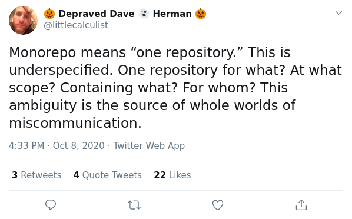

# Welcome to JS/TS Monorepos

A "monorepo" is a term used to describe packages (usually multiple)
within a single repository. In the words of @dherman..

   

Thankfully, in the JavaScript and TypeScript ecosystems, this
term is usually used in reference to the idea of

> _many packages, related by a shared purpose and (usually) deep entanglement_ located in a single git repo.

For this course, we'll take this as the canonical definition.

---

 <a href="./01-yarn-workspaces.md">Next: Yarn Workspaces ▶</a>

